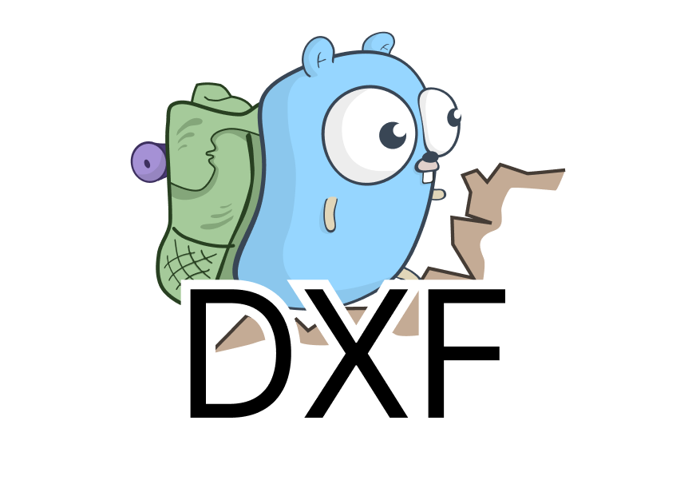
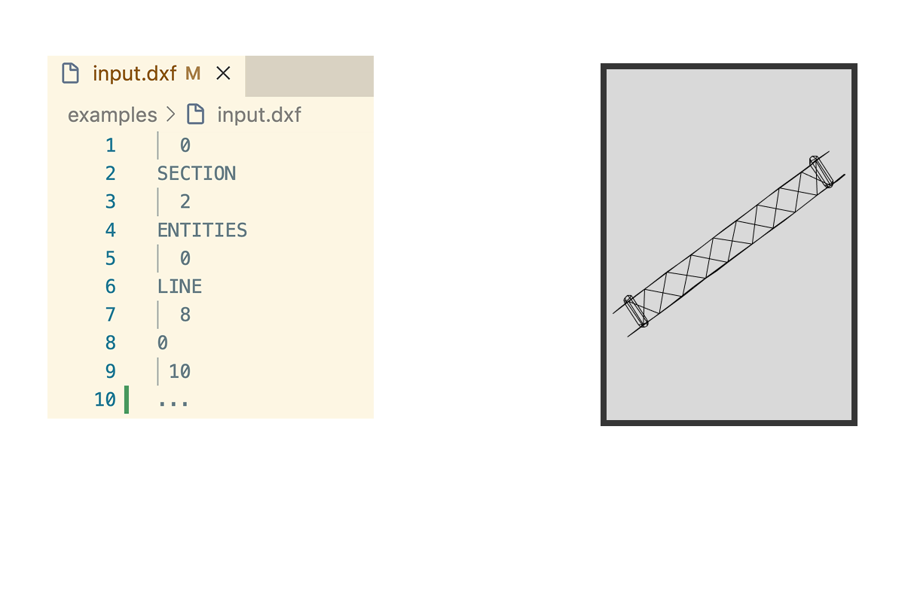

<p align="center">
  
  <h3 align="center">dxfconv</h3>
  <p align="center">A lightweight CAD DXF converter</p>
</p>

---

`dxfconv` is a lightweight Go library for converting DXF (Drawing Exchange Format) files into PDF or SVG. It is designed to be simple to use and easy to integrate into your Go applications.

<p align="center">
  
</p>

## Features

-   **DXF to PDF**: Convert CAD drawings to standard PDF documents.
-   **DXF to SVG**: Convert CAD drawings to Scalable Vector Graphics.
-   **Flexible Output**: Write to files or directly to `io.Writer` (e.g., `bytes.Buffer`, HTTP response).
-   **Entity Support**: Supports common DXF entities:
    -   LINES
    -   CIRCLES
    -   ARCS
    -   LWPOLYLINES
    -   POLYLINES
    -   SPLINES
    -   TEXT
-   **Customization**: Control page size (A4, A3, etc.), orientation (Portrait, Landscape), and scaling.
-   **Upcoming Support**
    - Planning to add support for the MTEXT entity in a future release.
    - Implement our own DXF parser to eliminate reliance on third-party libraries.

## Installation

```bash
go get github.com/daidai-ok/dxfconv
```

## Usage

### Basic Conversion (DXF to PDF)

```go
package main

import (
	"errors"
	"log"
	"os"

	dxfconv "github.com/daidai-ok/dxfconv/pkg/converter"
	"github.com/daidai-ok/dxfconv/pkg/dxfconverror"
)

func main() {
	f, err := os.Open("drawing.dxf")
	if err != nil {
		log.Fatalf("failed to open file: %v", err)
	}
	defer f.Close()

	out, err := os.Create("drawing.pdf")
	if err != nil {
		log.Fatalf("failed to create output file: %v", err)
	}
	defer out.Close()

	// Convert with default options (PDF, A4, Portrait)
	if err := dxfconv.Convert(f, out, nil); err != nil {
		var parseErr *dxfconverror.ParseError
		if errors.As(err, &parseErr) {
			// Unwrap and handle specific error
			log.Fatalf("DXF parse error: %v", parseErr.Unwrap())
		}
		log.Fatalf("conversion failed: %v", err)
	}
}
```

### DXF to SVG

```go
opts := dxfconv.DefaultOptions()
opts.Format = dxfconv.FormatSVG

dxfconv.Convert(f, out, opts)
```

### Writing to Buffer

```go
var buf bytes.Buffer
dxfconv.Convert(f, &buf, nil)
// Use buf.Bytes() ...
```

### Custom Options

You can customize the conversion process by passing an `Options` struct.

```go
opts := &dxfconv.Options{
	// PageSize: predefined (PageSizeA4, PageSizeA3) or custom
	PageSize:    dxfconv.PageSizeA3,
	
	// Orientation: Portrait or Landscape
	Orientation: dxfconv.OrientationLandscape,
	
	// Format: FormatPDF or FormatSVG
	Format:      dxfconv.FormatPDF,
	
	// Scale: 0.0 for auto-scale (fit to page), or specific value (e.g., 1.0 for 1:1)
	Scale:       0.0,
	
	// Margin: Page margin in millimeters
	Margin:      20.0,
	
	// Font: 
	// - For PDF: Path to a valid TTF font file (e.g., "fonts/Arial.ttf")
	// - For SVG: Font family name (e.g., "Arial")
	// If empty, a default font is used.
	Font:        "path/to/custom-font.ttf",
}

if err := dxfconv.Convert(f, out, opts); err != nil {
	// handle error
}
```

#### Option Details

| Option | Type | Description | Default |
| :--- | :--- | :--- | :--- |
| `PageSize` | `PageSize` | Page dimensions. Use `dxfconv.PageSizeA4`, `dxfconv.PageSizeA3`, or `{Width: w, Height: h}` (in mm). | `PageSizeA4` |
| `Orientation` | `Orientation` | Page orientation. `dxfconv.OrientationPortrait` or `dxfconv.OrientationLandscape`. | `OrientationPortrait` |
| `Format` | `Format` | Output format. `dxfconv.FormatPDF` or `dxfconv.FormatSVG`. | `FormatPDF` |
| `Scale` | `float64` | Scaling factor. Set to `0.0` to automatically fit the drawing within the page margins. | `0.0` (Auto) |
| `Margin` | `float64` | Margin around the drawing in millimeters. | `10.0` |
| `Font` | `string` | Custom font. **PDF**: absolute/relative path to `.ttf` file. **SVG**: CSS font-family name. Required for multi-byte characters (e.g., Japanese). | `""` (Built-in font) |

## License

MIT License

The [Go gopher](https://go.dev/blog/gopher) was designed by [Renée French](https://reneefrench.blogspot.com/).
The project icon is based on [gophers](https://github.com/egonelbre/gophers) by [Egon Elbre](https://github.com/egonelbre), licensed under [CC0 1.0 Universal](https://creativecommons.org/publicdomain/zero/1.0/).
